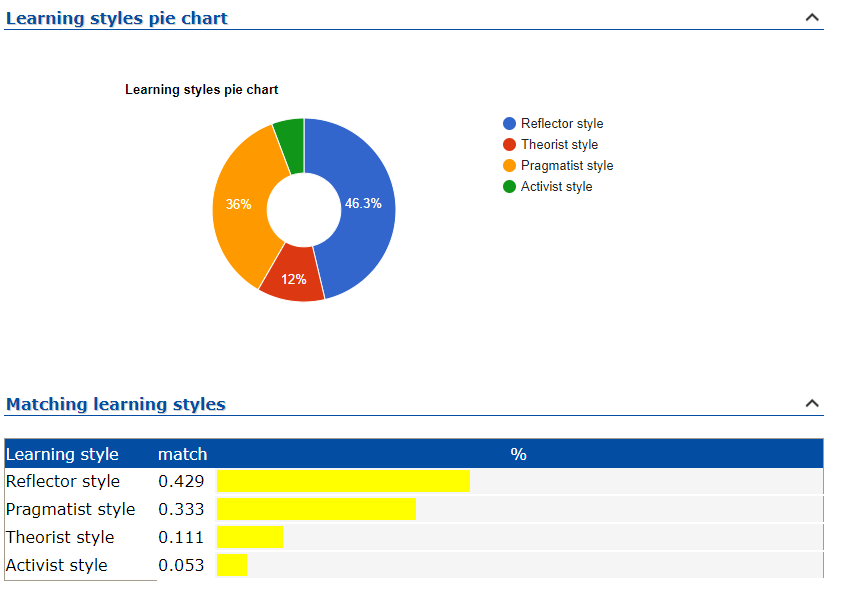
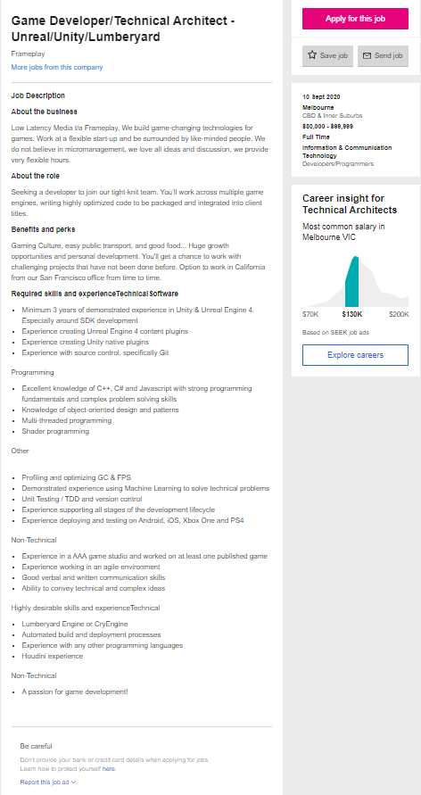

<html>

<body>

<hl>Assignment1</hl>

Personal Profile:

My name is Bashir Roumani, I grew up around computers.
The things that interest me the most are
electronics, cars (I worked as a mechanic in a workshop for a year),
games and video editing which I do in my spare time.

I can be a very blunt and honest person so I don't mind any critisism.
My short and long term goals at the moment are to succeed in my current course
and to learn how to create games in unity.

More information:

Student number: s3516673
Student email: s3516673@student.rmit.edu.au
Background: Born in Perth WA, parents are from Syria so I speak Arabic as a second language, I speak and read/write some Russian as well.
I have a youtube channel which I keep private from everyone that knows me personally.

My interests in IT started from a very young age, linked mostly to gaming. What I remember the most is when my older brother 
got me to play half life when I was 6. My current IT experience is completing a certIV in electonics & communications and networking at tafe.
I chose RMIT because I saw it was all online and fit well with my current schedule and there are skills I need to acquire like programming.
I expect to learn how to program, understand what consumers want from their programs and to progress towards how to combine those skills
for game development.

More information:

Student number: s3516673
Student email: s3516673@student.rmit.edu.au
Background: Born in Perth WA, parents are from Syria so I speak Arabic as a second language, I speak and read/write some Russian as well.
I have a youtube channel which I keep private from everyone that knows me personally.

My interests in IT started from a very young age, linked mostly to gaming. What I remember the most is when my older brother 
got me to play half life when I was 6. My current IT experience is completing a certIV in electonics & communications and networking at tafe.
I chose RMIT because I saw it was all online and fit well with my current schedule and there are skills I need to acquire like programming.
I expect to learn how to program, understand what consumers want from their programs and to progress towards how to combine those skills
for game development.

Ideal Job: Game Developer

https://www.seek.com.au/job/50541005?type=standard#searchRequestToken=4c4244c9-e7dd-492d-b165-c8212709642a

The job is appealing because the work is done across multiple game engines so its unlikely to get bored,
the hours are flexible.

The requirements for this position are 3 years of experience in unity and unreal engine 4, 
have a good understanding of C++ and javascript and programming in general also an understanding
in multi-thread and shader programming is a must. 
Currently I only have a small understanding in object-oriented design and unity so I have a long way
to go before I would be accepted for a position like this.

I plan on obtaining these skills by completing my studies at RMIT and working on making my own games in unity,
trying to work with unreal engine 4 and learning how to code in c++. It’s hard to go into specifics but that’s the plan at the moment.

Project Idea:

The current idea for a project I have is for a game I would make in unity. I am still unsure 
if it would be a single player or multiplayer game (preferably multiplayer).
It would be something similar to a moba or arena brawler like dota2 or battlerite 
but you would be able to play as 2 different characters at once or maybe swap between them
creating a chance for very high skill play. An arena brawler is probably an easier option as 
it would be more manageable for something like 1v1 battles.

There hasnt been much competition in the moba scene at all with league and dota2 pretty much 
having all of the players and battlerite being pretty much dead. So a hybrid of some sort
might be something people would be interested in as the current mobas are too similar right now
in my opinion (they used to be very different from each other but gradually started copying each other
to try and take the others players or appeal to a greater audience) and getting 
kind of stale with their updates.

As for the game itself its hard go into specific detail because I don't know how exactly to go
but I will try to be as simplistic as possible with it so i will go with a 1v1 or 2v2 brawler
where you swap between 1-3 characters and try to outplay your opponent.
Each character will have a different set of skills, the objective will be either to kill your 
oponent a number of times or complete a certain objective (not entirely sure about what it will be yet)

The tools that I think I will need are just unity which I have, its a game developer software.

A better understanding of unity is required which I think is doable.

If the project is successful it will likely be a simlified version or prototype to build on for a future project.

</body>
</html>
